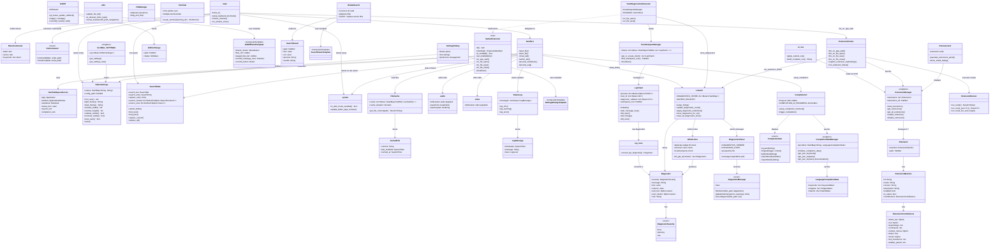

# Dvop Text Editor - Architecture UML Diagram

```mermaid
classDiagram
    direction TB

    %% ===== MAIN & APPLICATION =====
    class main {
        +build_ui()
        +setup_keyboard_shortcuts()
        +restore_session()
        +on_window_close()
    }

    class MenuCommand {
        +label: &str
        +action: &str
        +keywords: Vec~&str~
    }

    class ExtCommand {
        <<enum>>
        Command(label, script_path)
        Transform(label, script_path)
    }

    %% ===== HANDLERS =====
    class handlers {
        +open_file()
        +save_file()
        +close_tab()
        +switch_tab()
        +preview_markdown()
        +preview_svg()
    }

    class NewTabDependencies {
        +app: Application
        +window: ApplicationWindow
        +notebook: Notebook
        +status_bar: Label
        +search_refs
        +completion_refs
    }

    %% ===== SETTINGS =====
    class EditorSettings {
        +values: HashMap~String, String~
        +config_path: PathBuf
        +font_size() u32
        +light_theme() String
        +dark_theme() String
        +window_width() i32
        +window_height() i32
        +sidebar_visible() bool
        +terminal_visible() bool
        +auto_save() bool
        +save()
    }

    class GLOBAL_SETTINGS {
        <<singleton>>
        Lazy~Mutex~EditorSettings~~
        +get_settings()
        +get_settings_mut()
    }

    %% ===== SEARCH =====
    class SearchState {
        +search_bar: SearchBar
        +search_entry: SearchEntry
        +replace_entry: Entry
        +search_context: Rc~RefCell~Option~SearchContext~~~
        +source_view: Rc~RefCell~Option~View~~~
        +rebind_buffer()
        +find_next()
        +find_prev()
        +replace_current()
        +replace_all()
    }

    %% ===== SYNTAX =====
    class syntax {
        +is_dark_mode_enabled() bool
        +update_buffer_style_scheme()
    }

    %% ===== FILE CACHE =====
    class FileCache {
        +cache: Arc~Mutex~HashMap~PathBuf, CachedFile~~~
        +cache_duration: Duration
        +get_file_content(path) Result~String~
    }
    class CachedFile {
        +content: String
        +last_modified: SystemTime
        +cached_at: SystemTime
    }

    %% ===== AUDIO / VIDEO =====
    class audio {
        +GStreamer audio playback
        +waveform visualization
        +spectrogram rendering
    }
    class video {
        +GStreamer video playback
    }

    %% ===== STATUS LOG =====
    class StatusLog {
        +messages: VecDeque~LogMessage~
        +log_info()
        +log_warning()
        +log_error()
    }
    class LogMessage {
        +timestamp: SystemTime
        +message: String
        +level: LogLevel
    }

    %% ===== UTILS =====
    class utils {
        +update_file_list()
        +is_allowed_mime_type()
        +create_breadcrumb_path_navigation()
    }

    %% ===== UI MODULE =====
    class ui_css {
        +apply_custom_css()
        +build_complete_css() String
    }

    class FileManager {
        +clipboard operations
        +drag_and_drop
    }

    class Terminal {
        +create_terminal(working_dir) VteTerminal
        +color palette sync
        +multiple terminal tabs
    }

    class GitDiff {
        +DiffViewer
        +git_status_update_callback()
        +stage() / unstage()
        +commit() / push() / pull()
    }

    class GitFileChange {
        +path: PathBuf
        +status: GitStatus
    }

    class GitDiffPanelTemplate {
        <<CompositeTemplate>>
        +branch_button: MenuButton
        +files_list: ListBox
        +staged_files_list: ListBox
        +commit_message_view: TextView
        +commit_button: Button
    }

    class GlobalSearch {
        +recursive dir walk
        +gitignore filter
        +search / replace across files
    }

    class SearchResult {
        +path: PathBuf
        +line: usize
        +col: usize
        +preview: String
        +needle: String
    }

    class SearchPanelTemplate {
        <<CompositeTemplate>>
    }

    class SettingsDialog {
        +theme picker
        +font settings
        +preference management
    }

    class SettingsDialogTemplate {
        <<CompositeTemplate>>
    }

    %% ===== LSP MODULE =====
    class LspClient {
        +process: Arc~Mutex~Option~Child~~~
        +next_id: Arc~Mutex~i32~~
        +diagnostic_callback: Arc~Mutex~Fn~~
        +workspace_root: PathBuf
        +initialize()
        +start_message_loop()
        +did_open()
        +did_change()
        +did_save()
    }

    class RustAnalyzerManager {
        +clients: Arc~Mutex~HashMap~PathBuf, Arc~LspClient~~~~
        +get_or_create_client() Arc~LspClient~
        +find_workspace_root() PathBuf
        +shutdown()
    }

    class lsp_mod {
        +convert_lsp_diagnostic() Diagnostic
    }

    %% ===== LINTER MODULE =====
    class Diagnostic {
        +severity: DiagnosticSeverity
        +message: String
        +line: usize
        +column: usize
        +end_line: Option~usize~
        +end_column: Option~usize~
        +rule: String
    }

    class DiagnosticSeverity {
        <<enum>>
        Error
        Warning
        Info
    }

    class LinterUI {
        +DIAGNOSTICS_STORE: Arc~Mutex~HashMap~~
        +BUFFER_REGISTRY
        +setup_linting()
        +update_diagnostics_count()
        +apply_diagnostic_underlines()
        +store_diagnostics_for_uri()
        +clear_all_diagnostics_store()
    }

    class DiagnosticsPanel {
        +DIAGNOSTICS_SENDER
        +EXPANSION_STATE
        +message loop (100ms poll)
        +grouped by file
    }

    class DiagnosticMessage {
        <<enum>>
        Clear
        FileSection(file_path, diagnostics)
        UpdateSummary(errors, warnings, infos)
        FocusDiagnostic(file_path, line)
    }

    class GtkUiLinter {
        +lint_gtk_ui(content) Vec~Diagnostic~
        +duplicate widget ID check
        +unknown class check
        +invalid property check
    }

    %% ===== COMPLETION MODULE =====
    class CompletionDataManager {
        <<singleton>>
        +providers: HashMap~String, LanguageCompletionData~
        +initialize_completion_data()
        +get_json_keywords()
        +get_json_snippets()
        +get_json_keyword_documentation()
    }

    class LanguageCompletionData {
        +keywords: Vec~KeywordData~
        +snippets: Vec~SnippetData~
        +imports: Vec~ImportData~
    }

    class CompletionUI {
        +Popover with ListBox
        +setup_completion_shortcuts()
        +trigger_completion()
        +COMPLETION_IN_PROGRESS: AtomicBool
    }

    class CompletionItem {
        <<enum>>
        Keyword(String)
        Snippet(trigger, content)
        BufferWord(String)
        ImportItem(ImportItem)
        ImportModule(String)
    }

    %% ===== EXTENSIONS MODULE =====
    class ExtensionManifest {
        +id: String
        +name: String
        +version: String
        +description: String
        +enabled: bool
        +is_native: bool
        +contributions: ExtensionContributions
    }

    class ExtensionContributions {
        +status_bar: Option
        +css: Option
        +keybindings: Vec
        +commands: Vec
        +context_menus: Option
        +linters: Vec
        +hooks: Option
        +text_transforms: Vec
        +sidebar_panels: Vec
    }

    class Extension {
        +manifest: ExtensionManifest
        +path: PathBuf
    }

    class ExtensionManager {
        <<singleton>>
        +extensions: Vec~Extension~
        +extensions_dir: PathBuf
        +load_extensions()
        +get_extensions()
        +get_all_extensions()
        +enable_extension()
        +disable_extension()
    }

    class NativeExtension {
        <<trait>>
        +id() &str
        +manifest() ExtensionManifest
        +is_enabled() bool
        +set_enabled(bool)
        +on_app_start()
        +on_file_open()
        +on_file_save()
        +on_file_close()
        +shutdown()
    }

    class RustDiagnosticsExtension {
        +RustAnalyzerManager
        +ENABLED: AtomicBool
        +on_file_open()
        +on_file_save()
    }

    class ExtensionHooks {
        +fire_on_app_start()
        +fire_on_file_open()
        +fire_on_file_save()
        +fire_on_file_close()
        +register_extension_keybindings()
        +run_extension_linters()
    }

    class ExtensionRunner {
        +run_script() Result~String~
        +run_script_json~T~() Result~T~
        +run_script_fire_and_forget()
    }

    class ExtensionsUI {
        +populate_extensions_panel()
        +show_install_dialog()
        +extension cards
    }

    %% ========== RELATIONSHIPS ==========

    %% Main dependencies
    main --> handlers : delegates to
    main --> EditorSettings : reads config
    main --> syntax : theme setup
    main --> SearchState : init search
    main --> ExtensionHooks : fire_on_app_start
    main --> MenuCommand : builds menus
    main --> ExtCommand : extension commands

    %% Handlers core relationships
    handlers --> NewTabDependencies : uses
    handlers --> EditorSettings : read/write
    handlers --> SearchState : rebind on tab switch
    handlers --> syntax : style scheme
    handlers --> LinterUI : setup_linting
    handlers --> CompletionUI : setup_completion
    handlers --> FileCache : read files
    handlers --> audio : audio tabs
    handlers --> video : video tabs
    handlers --> StatusLog : status updates

    %% Settings
    GLOBAL_SETTINGS --> EditorSettings : wraps

    %% File Cache
    FileCache --> CachedFile : stores

    %% Status Log
    StatusLog --> LogMessage : stores

    %% UI relationships
    GitDiff --> GitFileChange : tracks
    GitDiff --> GitDiffPanelTemplate : uses template
    GlobalSearch --> SearchResult : produces
    GlobalSearch --> SearchPanelTemplate : uses template
    SettingsDialog --> SettingsDialogTemplate : uses template
    SettingsDialog --> EditorSettings : modifies
    ui_css --> ExtensionManager : loads ext CSS

    %% LSP relationships
    RustAnalyzerManager --> LspClient : manages 1..*
    lsp_mod --> Diagnostic : converts to
    LspClient --> lsp_mod : raw diagnostics

    %% Linter relationships
    Diagnostic --> DiagnosticSeverity : has
    LinterUI --> Diagnostic : stores
    LinterUI --> DiagnosticsPanel : sends messages
    DiagnosticsPanel --> DiagnosticMessage : receives
    GtkUiLinter --> Diagnostic : produces
    LinterUI --> GtkUiLinter : built-in linter

    %% Completion
    CompletionDataManager --> LanguageCompletionData : caches
    CompletionUI --> CompletionItem : displays
    CompletionUI --> CompletionDataManager : queries

    %% Extension relationships
    Extension --> ExtensionManifest : has
    ExtensionManifest --> ExtensionContributions : has
    ExtensionManager --> Extension : manages 0..*
    ExtensionHooks --> ExtensionManager : queries
    ExtensionHooks --> ExtensionRunner : executes scripts
    ExtensionsUI --> ExtensionManager : displays
    RustDiagnosticsExtension ..|> NativeExtension : implements
    RustDiagnosticsExtension --> RustAnalyzerManager : wraps
    RustDiagnosticsExtension --> LinterUI : store_diagnostics
    ExtensionHooks --> LinterUI : run_extension_linters
```
